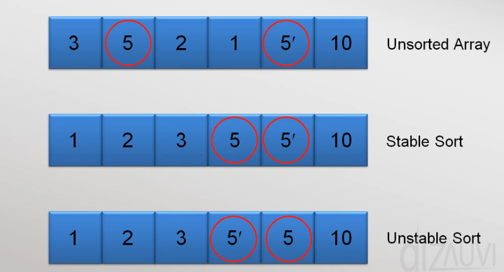
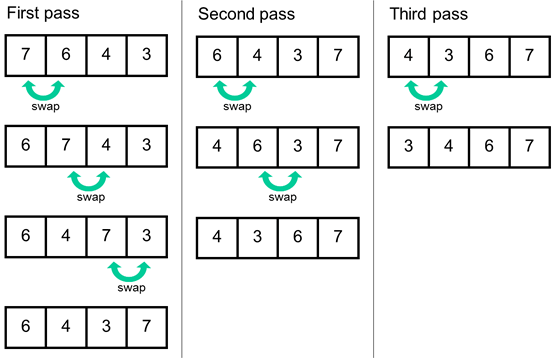

# Sorting Algorithm

Sorting algorithm plays a key role in sorting out the given data set in an order for an easy and effective access of data items, and plays an important role in problem-solving solution. The prerequisites for learning/using these sorting algorithms are:
- Basic programming language syntax
- [Concepts of Array Data structure](../Array_Data_Structure/README.md "Learn Array Data Structure")
- Time Complexity
- Space Complexity
- [Stable vs Unstable algorithm](#stable-vs-unstable-algorithm "Learn about stable & unstable algorithms")
- Recursion *( for sorting-algo like merges sort, quick sort )*

Here we are going to discuss the following sorting algorithms:
- [Bubble Sort](#bubble-sort-algorithm "Learn about bubble sort")
- [Selection Sort](#selection-sort-algorithm "Learn about selection sort")
- [Insertion Sort](#insertion-sort-algorithm "Learn about insertion sort")
- [Cyclic Sort](#cyclic-sort-algorithm "Learn about cyclic sort")
<!--
- [Merge Sort](#merge-sort-algorithm "Learn about merge sort")
- [Quick Sort](#quick-sort-algorithm "Learn about quick sort")
-->

## Note:

- While reading the documentation, `take a note of highlighting markings`.
- `Read` the highlighting `markings of` each `individual point continuously` **&** `repeat the same for another individual point` for **better Understanding**.
- `Make use` of explanation `videos links` which are **time stamped** at a particular point `for saving time`.
- `Use the documentation links` for even **in depth** understanding.
- You can also `use the implementation of algorithm in programming language` *(which also documented with explanation of the algorithm)* for even **better understanding**.

## Stable vs Unstable Algorithm

- Any sorting `algorithms can be determined either as a Stable algorithms or as an Unstable algorithms`.
- Determining an algorithm as stable or unstable might seem like a small thing and doesn't make much difference whether it's stable or unstable. But, it plays a huge role in overcoming problems like the below-mentioned example.

### What is a Stable (or) Unstable Algorithm ?

- Consider the situation, `An algorithm` ( say a sorting algorithm ) `is given an input` data-set which `contains duplicate data item(s)`.
- If the algorithm able to sort in such a way that the `FIRST OCCURRENCE of the duplicate data item` *( w.r.t the given original data set )* `STAYS AS` the `FIRST OCCURRENCE even after sorting`, Then we say `that algorithm is 'Stable algorithm'`.
- `Unstable algorithm is quite opposite` to the stable algorithm.
- So, if the first occurrence of the duplicate data item doesn't stay the first occurrence of the duplicate data item then it's said to be Unstable Algorithm.

  

###  Why do we need determine whether the algorithm is stable or not ?

- Consider a situation where you have set of data where the *Name* column is mapped with *Age* Column.
- Say the user wanted to `sort` the data set `w.r.t 'Age'` first, just as shown below.

  

- `After sorting` the data set w.r.t Age, say the `user wanted to sort` the same data set `w.r.t 'Name'`.
- Then, if we have implemented a `stable algorithm`, the data `displayed will be in sorted order` both in terms of 'Age' and 'Name'.
- But, it's not same with the `unstable algorithm`, since the order of 'Age' `will be disordered` after sorting 'Name' column ( Just as shown in below figure ).

  

- This is why need to determine the algorithm  as stable or unstable to make better use of it w.r.t the situation demands.

## Bubble Sort Algorithm

- Bubble Sort is one of the **basic sorting algorithms** which is taught as for beginner.
- Bubble sort is `implemented by sorting the largest element` ( if we're sorting in increasing order ) in the data set `for each iteration`/pass.
- The bubble sort is `implemented by a single nested loop`, where the `inner loop sorts the largest element` to the right-most side `for each 'i'-th iteration/pass of the outer loop`.
- `At the end of each 'i'-th iteration`/pass of the outer loop, the `largest element` of first 'n-i' number of elements in data set `will be sorted`.
- Since, `for every pass we are sorting one element`. `It would take 'n'-passes` in total `to sort all the 'n' elements` of the data set.
- `Thus, the time complexity` of this algorithm becomes `O(n)`. And the `Space complexity will remain constant` since we are not allocating addition memory.
- This is a [`Stable Algorithm`](#stable-vs-unstable-algorithm "Go back to stable & unstable algorithms").

  

- [Read Bubble Sort Documentation](https://www.geeksforgeeks.org/bubble-sort/ "Look out for more about Bubble Sort in GFG")
- [Watching detailed explanation](https://youtu.be/F5MZyqRp_IM?list=PL9gnSGHSqcnr_DxHsP7AW9ftq0AtAyYqJ&t=194 "Look out for more detailed explanation by kunal")
- [See the Java Implementation of Bubble Sort](../Sorting_Algo/Bubble_Sort.java "Check out the Java implementation of bubble sort")

#### Time Complexity:

> **Best case:** O(n)
>
>> Linear Time complexity.
>
>> **Occurrence:**
>>> When the given data set is already sorted in requested sorting order.
>
>>**Why ?:**
>>> If the array is sorted then the algorithm will not swap in inner loop for every 'n' element. The algorithm will only iterate over the elements of the array resulting in Linear Time complexity.

> **Worst case:** O(n2)
>
>> Quadratic Time complexity.
>
>> **Occurrence:**
>>> When the given data set is sorted in opposite order of the requested sorting order.
>
>> **Why ?:**
>>> If the array is sorted in opposite order of the requested sorting order. Then it will take 'n' no. of swaps for a "single" element to be sorted. So, to sort all 'n' elements we need to swap n*n elements resulting in Quadratic Time complexity.

#### Space Complexity:

> **Any case:** O(1)
>
>> Linear Space complexity.

## Selection Sort Algorithm

- Selection sort is another **basic sorting algorithm** apart from [Bubble Sort](#bubble-sort-algorithm "Go back to Bubble Sort").
- Selection sort is also `implemented using a nested loop`, but it's different from implementation of [Bubble Sort](#bubble-sort-algorithm "Go back to Bubble Sort").
- We `start` this algorithm `by choosing an element` in the given data set, In my case, I have chosen the first element to start with.
- Now, In the inner loop, we will `compare the selected element with the whole data set` towards the right side.
- Since this algorithm is for sorting in increasing order *( it can be for decreasing order too )*, we `swap the selected element every single time we find even smaller element` while iterating throughout data set **using inner loop**.
- `For each i-th iteration, One element will get sorted` toward the left-hand side i.e, the **sorted side** and the element which are going to get sorted first are the smaller elements.
- `The inner loop will compare nearly 'n' elements for 'n' no. of times to sort all 'n' elements`, Thus the Time complexity of this algorithm is also same as '[Bubble Sort](#bubble-sort-algorithm "Go back to Bubble Sort")' i.e., O(n2).
- The `Space complexity` of this algorithm `remains constant` as we are not allocating additional memory for implementing this algorithm.
- This **Not** a [Stable algorithm](#stable-vs-unstable-algorithm "Go back to stable & unstable algorithms") i.e., [`it's an Unstable algorithm`](#stable-vs-unstable-algorithm "Go back to stable & unstable algorithms").

  

- [Read Selection Sort Documentation](https://www.geeksforgeeks.org/selection-sort/ "Look out for more about Selection Sort in GFG")
- [Watch detailed implementation](https://youtu.be/BruMUw6mV1c?t=298 "Look out for more detailed explanation by NPTEL Course: DSA using Python")
- [See the Java Implementation of Selection Sort](../Sorting_Algo/Selection_Sort.java "Check out the Java implementation of Selection sort")

#### Time Complexity:

> **Best/Worst case:** O(n2)
>
>> Quadratic Time complexity.
>
>> **Occurrence:**
>>>  Occurs for any case.
>
>> **Why ?:**
>>>  The algorithm will compare 'n' no. of elements for all 'n' no. of elements in any case.

#### Space Complexity:

> **Any case:** O(1)
>
>> Linear Space complexity.

## Insertion Sort Algorithm

- Insertion sort algorithm is another **basic sorting algorithm** apart from above two sorting algorithms.
- Insertion sort is also `implemented using a nested loop`, but when compare with above two algorithm **[this algorithm is even better](#why-insertion-sorting-algorithm-is-better-than-above-algorithm- "Here is why")**.
- In Insertion sort, we divide the array **( By imagination )** into two section, One side as the sorted one and the other unsorted.
- The basic ideology of this algorithm is that, we `take an element from the unsorted part` of the array and `insert it into the sorted section` of the array `such a way that` even after inserting the element `the sorted section remains sorted`.
- In the outer loop iterates for 'n-1' times in total because there is an occurrence of **indexOutOfBounds** error from the inner loop.
- The `Inner loop takes the 'i+1'-th element` of the array *( the unsorted part, say it's on right-side )* `and compares with the elements on left-side side` *( Which is the sorted side )* and `inserts it` in its rightful place.
- In the Inner loop, the `'i+1'-th element will be swapped multiple times` with the elements of sorted part of array `unti`l the order's `condition is met`.
- Say, the sorting algorithm is sorting in increasing order, Then the 'i+1'-th element will be swapped multiple times until it comes across an element which even smaller than the 'i+1'-th element.
- This process will **continue until** the number of sorted elements **equals to** the number of elements in the given array.
- This is a [`Stable Algorithm`](#stable-vs-unstable-algorithm "Go back to stable & unstable algorithms").

  

- [Read Insertion Sort Documentation](https://www.geeksforgeeks.org/insertion-sort/ "Look out for more about Insertion Sort in GFG")
- [Watch detailed implementation](https://youtu.be/By_5-RRqVeE?list=PL9gnSGHSqcnr_DxHsP7AW9ftq0AtAyYqJ&t=116 "Look out for more detailed explanation by Kunal")
- [See the Java Implementation of Insertion Sort](../Sorting_Algo/Selection_Sort.java "Check out the Java implementation of Insertion sort")

#### Time Complexity:

> **Best case:** O(n)
>
>> Linear Time complexity.
>
>> **Occurrence:**
>>> When the given data set is already sorted in requested sorting order.
>
>> **Why ?:**
>>> Say the algorithm gets the sorted input. When the 'i+1'-th element compares itself with sorted section, it ends right there. This will happen to all the remaining 'n' (nearly) elements. Hence, the outer loop iterates over nearly 'n' element without any swap resulting in O(n) complexity.

> **Worst case:** O(n2)
>
>> Quadratic Time complexity.
>
>> **Occurrence:**
>>> When the given data set is sorted in opposite order of the requested sorting order.
>
>> **Why ?:**
>>> If the array is sorted in opposite order of the requested sorting order. Then it will take 'n' no. of swaps for a "single" element to be inserted into sorted section. So, to sort all 'n' elements we need to swap n*n elements resulting in Quadratic Time complexity.

#### Space Complexity:

> **Any case:** O(1)
>
>> Linear Space complexity.
 
---

### Why Insertion Sorting Algorithm is better than above algorithm ?
> - Insertion sorting algorithm practically take `less no. of comparisons` than [Bubble Sort](#bubble-sort-algorithm "Go back to Bubble Sort").
>
> - **Does not** make any unnecessary comparisons like in [Selection Sort](#selection-sort-algorithm "Go back to selection sort").
>
> - Unlike [Selection Sort](#selection-sort-algorithm "Go back to selection sort"), it is a [`Stable Algorithm`](#stable-vs-unstable-algorithm "Go back to stable & unstable algorithms").
>
> -  `Works effectively on` data sets of `smaller dimensions` ( or ) the data sets which are `partially sorted`.
>
> - Also used as part of **Hybrid Algorithm**.

---

## Cyclic Sort Algorithm

- Cyclic sort is one of the **effective sorting algorithm** compared to the above sorting algorithms.
- Because this algorithm `sorts` all the elements in the order in a `single pass`.
- The **only restriction / requirement** is that the `all the elements of the input data set` has to be `in range of 1 to 'n'` elements `(or) 0 to 'n'` elements.
- This algorithm works on a **key principal / 'condition'** and that is,
  - `'value'-1 == 'index'` , when the elements in data set `range from 1 to 'n'`. *( the one we are going to use here )*
  - `'value' == 'index'` , when the elements in data set `range from 0 to 'n'`.
  - for the below explanation, consider the key word **'condition'** referring to the above conditions.
- This algorithm starts by taking the `'index' as zero` and the value of `'value' as element at 'index'-th index`.
- Then we will verify if the 'condition' is true or false.
- If the `'condition' is true`,
  - Then we can say that the `element is in its rightful place` as the condition has been satisfied.
  - So, we `increment the index` to check for remaining elements of the data set.
  - `After increment`, we go back to the condition to `check the next elements`.
- but If the `condition fails` then,
  - we will `swap the 'value'` to its rightful place `which lies at the index, 'value'-1`.
  - So, we will swap the 'value' at index 'index' with the element at index 'value'-1.
  - `After this swap`, we can say that the `value` is placed in its rightful place (or) it `is sorted`.
  - Unlike the 'condition' true case, we **won't be incrementing the 'index'**.
  - Because there might be a chance that this element at index 'index' is not sorted.
  - So, `after swapping` we will `go back to verify the 'condition'`.
- **After each iteration, one unique element will be sorted to its rightful place**.
- So, to sort all 'n' elements we have to iterate though the whole data set.

> **Key point to Remember :**
> - This algorithm is NOT a Stable algorithm, which means it's an [`Unstable Algorithm`](#stable-vs-unstable-algorithm "Go back to stable & unstable algorithms").
> - Since this algorithm gives the `best performance` than other sorting algorithm we discussed till now,
> - We need to remember where we can use this algorithm.,
>
>> We can use this algorithm when we have a situation where the dataset will be containing ONLY the elements ranged from 0 to 'n' (or) from 1 to 'n'.
>
>> In some situations (where the above condition is applied), where need to sort in O(n) time complexity and O(1) space complexity.

  

- [Read Cyclic Sort Documentation [ Read from Method 2 ] ](https://www.geeksforgeeks.org/cycle-sort/ "Look out for more about Cyclic Sort in GFG")
- [Watch detailed implementation](https://youtu.be/JfinxytTYFQ?list=PL9gnSGHSqcnr_DxHsP7AW9ftq0AtAyYqJ&t=292 "Look out for more detailed explanation by Kunal")
- [See the Java Implementation of Cyclic Sort](../Sorting_Algo/Cyclic_Sort.java "Check out the Java implementation of Cyclic sort")

#### Time Complexity:

> **Best case:** O(n)
>
>> Linear Time complexity.
>
>> **Occurrence:**
>>> When the given data set is already sorted in requested sorting order.
>
>> **Why ?:**
>>> If the given data set is sorted then there will be no swapping done, the loop will on iterate over the data set resulting the Linear Time complexity.

> **Worst case:** O(n)
>
>> Linear Time complexity.
>
>> **Occurrence:**
>>> When the elements are placed such a way that it take n-1 swaps to get the 'value' in its place.
>
>> **Why ?:**
>>> When we have the above-mentioned case, it would take n-1 swaps to set the 'value' in its place. On other hand, due to these swaps, th other 'n-1' elements have already been sorted. All that left is to iterate over the elements. 
>>
>>> Thus, (n-1) < swaps > + n < iterations > = 2*n+1 => O(n).

#### Space Complexity:

> **Any case:** O(1)
>
>> Linear Space complexity.
